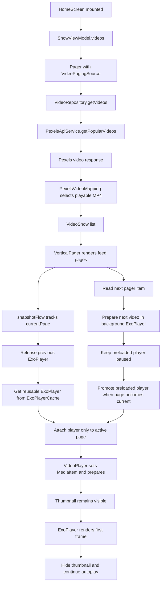
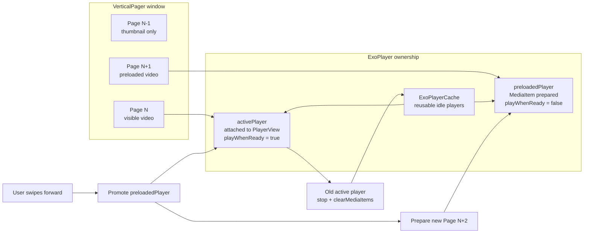
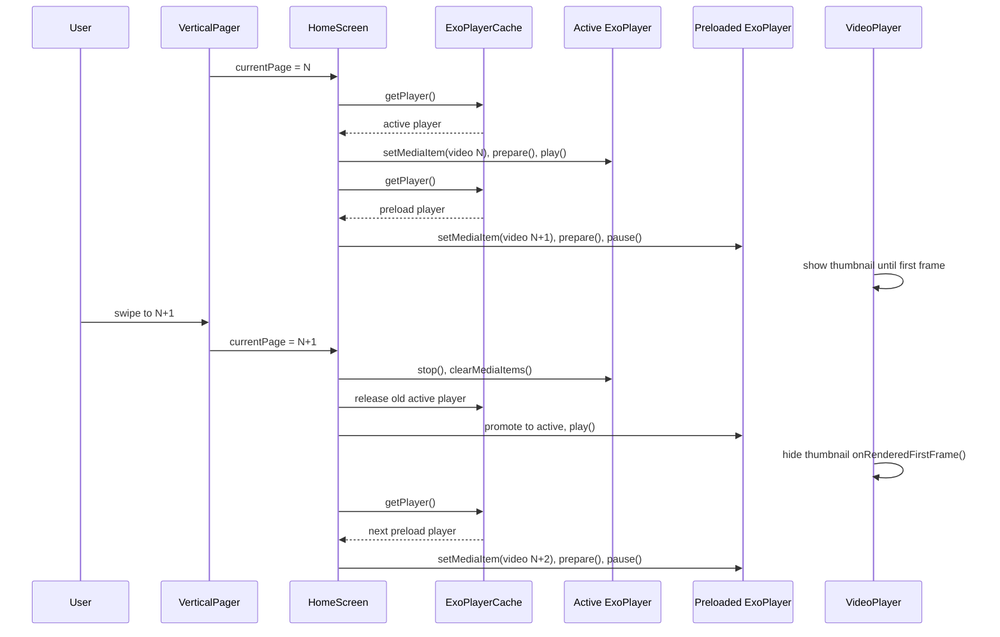
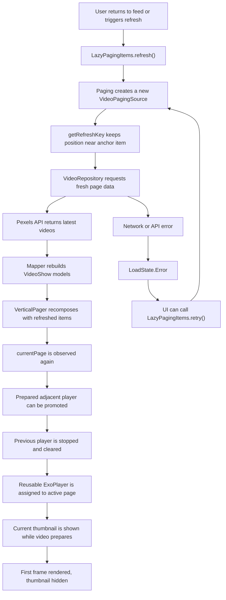

# Flick

A modern TikTok-style vertical video streaming app for Android, built with Kotlin, Jetpack Compose, and clean architecture principles.


## Features

- Vertical video feed with smooth swiping (TikTok-style)
- Video search functionality
- Like and comment on videos
- User profiles and authentication
- Optimized video playback with ExoPlayer
- Clean architecture with multi-module structure

## Architecture

```
Flick/
├── app/                    # Main application module
│   ├── ui/                # UI layer (Compose screens, ViewModels)
│   ├── navigation/        # Compose Navigation
│   └── di/                # Dependency Injection (Koin)
├── data/
│   ├── remote/            # Network layer (Retrofit, Pexels API)
│   ├── repository/        # Repository implementations
│   └── local/             # Local storage (SharedPreferences)
└── common/                # Shared UI components
```

### Tech Stack

| Category | Technology |
|----------|------------|
| UI | Jetpack Compose, Material 3 |
| Video | ExoPlayer (Media3) |
| Networking | Retrofit, OkHttp |
| DI | Koin |
| Image Loading | Coil |
| Async | Kotlin Coroutines, Flow |
| Paging | Paging 3 |
| Logging | Timber |
| Testing | JUnit, MockK, Turbine |

## Video Loading Pipeline

Flick uses a paged, active-player model for the vertical feed. Video metadata is loaded through Paging 3, mapped into UI models, and then only the currently visible pager page receives an `ExoPlayer` instance. Each page shows the correct thumbnail with Coil while Media3 prepares the video; the thumbnail is removed after ExoPlayer renders the first frame.



## Adjacent Video Preload Technique





### Playback State Strategy

- `ShowViewModel` owns the feed stream and exposes `Flow<PagingData<VideoShow>>`, cached in `viewModelScope`.
- `VideoPagingSource` requests pages from `VideoRepository`, so the UI can load more videos as the user scrolls.
- `VideoRepositoryImp` combines Pexels video data with local interaction state, such as liked videos and comment counts.
- `PexelsVideoMapping` chooses an MP4 file optimized for mobile playback, preferring HD/SD portrait-friendly sizes over very large files.
- `HomeScreen` uses `VerticalPager` and `snapshotFlow` to detect the active page.
- `ExoPlayerCache` reuses player instances to reduce allocation cost while scrolling.
- `VideoPlayer` overlays the current video's thumbnail until `onRenderedFirstFrame`, preventing a reused player from showing a previous video's frame during page transitions.
- The next video is prepared in a paused background player, then promoted when the user scrolls onto that page.

### Why This Design Works

- **Smooth scrolling:** Paging 3 loads the feed incrementally instead of downloading every video upfront.
- **Lower playback overhead:** Reusing `ExoPlayer` instances avoids constantly creating and destroying media players.
- **Faster next-video start:** The adjacent video is already prepared before it becomes visible, reducing the wait after a swipe.
- **Correct visual handoff:** The active page owns the player, and the thumbnail belongs to the current `videoUrl`, so users do not see stale thumbnails or old video frames.
- **Interview talking point:** This implementation separates data loading, playback ownership, and rendering state, which makes the feed easier to debug and reason about.

## Reload and Refresh Flow

The feed is built on Paging 3, so reload behavior is centered around invalidating or refreshing the `LazyPagingItems` stream. The current home feed does not expose a visible pull-to-refresh control yet, but the architecture already supports refresh/retry through Paging's `refresh()`, `retry()`, `LoadState`, and `PagingSource.getRefreshKey()` APIs.



### Reload Responsibilities

- `VideoPagingSource.getRefreshKey()` determines which page should reload after invalidation, keeping the refreshed feed near the user's current scroll position.
- `LazyPagingItems.refresh()` is the natural entry point for a future pull-to-refresh gesture on the home feed.
- `LazyPagingItems.retry()` can retry failed network loads without discarding already loaded paging data.
- `LoadState.Refresh` represents the first-page reload state; `LoadState.Append` represents loading more content at the end of the feed.
- `HomeScreen` resets playback ownership on page changes by stopping the previous player, clearing its media items, returning it to `ExoPlayerCache`, and assigning a player only to the active page.
- `HomeScreen` also keeps one adjacent video prepared in a paused player, so swiping forward can promote a warm player instead of waiting for a cold prepare.
- `VideoPlayer` keeps reloads visually stable by showing the refreshed item's thumbnail until Media3 confirms the new first frame has rendered.

### Suggested Pull-To-Refresh Hook

If a visible reload gesture is added later, it should call `videos.refresh()` from the `HomeScreen` layer and render loading/error states from `videos.loadState.refresh`. That keeps reload behavior inside the Paging pipeline instead of adding a second custom networking path.

## Setup

### Prerequisites

- Android Studio Hedgehog (2023.1.1) or newer
- JDK 8 or higher
- Android SDK 34

### API Key Configuration

This app uses the [Pexels API](https://www.pexels.com/api/) for video content. To run the app:

1. Get a free API key from [Pexels](https://www.pexels.com/api/)
2. Add your API key to `local.properties`:

```properties
PEXELS_API_KEY=your_api_key_here
```

### Build

```bash
# Clone the repository
git clone https://github.com/yourusername/flick-android.git

# Open in Android Studio and sync Gradle

# Or build from command line
./gradlew assembleDebug
```

### Run Tests

```bash
./gradlew test
```

## Module Structure

### `:app`
Main application module containing:
- Compose UI screens (Home, Search, Profile)
- ViewModels with state management
- Navigation setup
- Dependency injection configuration

### `:data:remote`
Network layer:
- Pexels API service
- API models and response handling
- OkHttp client configuration

### `:data:repository`
Business logic:
- Repository implementations
- Data mappers (Pexels -> Domain models)
- Caching strategies

### `:data:local`
Local storage:
- Video interaction storage (likes, comments)
- User preferences
- SharedPreferences wrapper

### `:common`
Shared components:
- Custom UI views
- Common composables
- Theme and styling

## Key Components

### Video Playback
- `ExoPlayerCache`: Manages a pool of ExoPlayer instances for efficient memory usage
- `VideoPlayer`: Compose wrapper for ExoPlayer with lifecycle awareness
- `HomeScreen`: VerticalPager-based video feed

### API Integration
- `PexelsApiService`: Retrofit interface for Pexels Video API
- `VideoRepositoryImp`: Combines remote API with local storage
- `PexelsVideoMapping`: Transforms API responses to domain models

### State Management
- `UiState<T>`: Sealed class for Loading/Success/Error states
- `ShowViewModel`: Manages video feed, likes, and comments
- `SearchViewModel`: Handles search query and results

## Acknowledgments

- [Pexels](https://www.pexels.com/) for providing free video content API
- [ExoPlayer](https://github.com/google/ExoPlayer) for video playback
- [Jetpack Compose](https://developer.android.com/jetpack/compose) for modern UI toolkit
